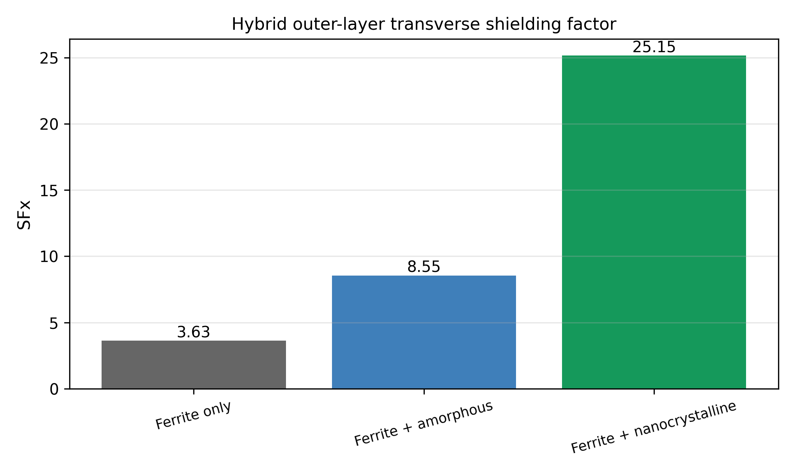
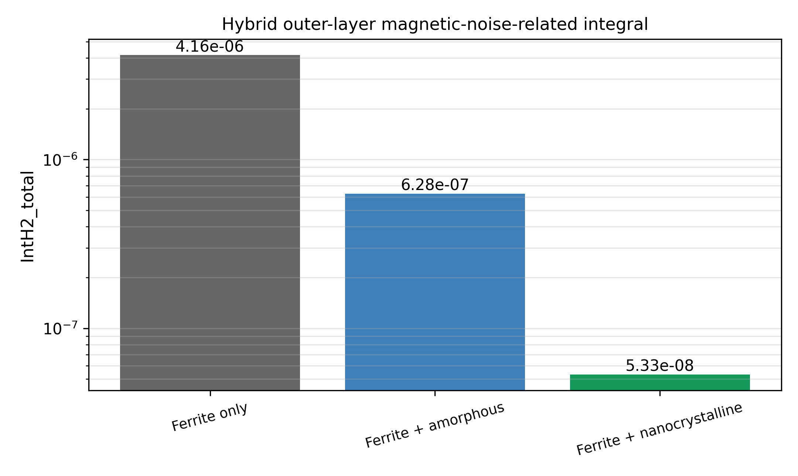
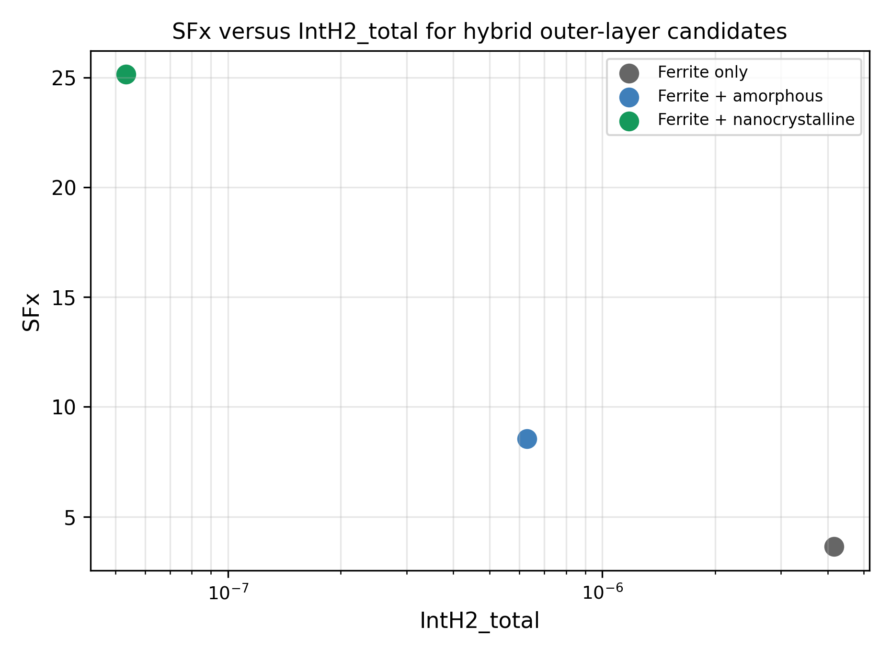

# 6.3 组会汇报：多层铁氧体屏蔽桶与外层高磁导材料仿真进展

日期：2026-06-03

## 1. 这一周主要做了什么

在原来四层铁氧体屏蔽桶的基础上，把师兄的论文批注里提到的两个问题往前推进：

1. 外面再加一层非晶或纳米晶高磁导材料，看整体横向屏蔽因子能不能明显提高。
2. 为后面把磁强计放进屏蔽桶内测灵敏度 PSD 做准备，先把仿真结构、评价指标和样机候选结构定下来。

目前先完成的是第一个问题：
四层铁氧体外侧增加高磁导外层的横向屏蔽仿真。

## 2. 已确认的基准结构

基准结构沿用前面已经筛选过的四层铁氧体开口圆筒：

| 项目 | 参数 |
| --- | --- |
| case_id | C2_N4_t015_g008_x |
| 内半径 | 100 mm |
| 长度 | 200 mm |
| 层数 | 4 |
| 单层铁氧体厚度 | 0.15 mm |
| 层间间隙 | 0.08 mm |
| 铁氧体总厚度 | 0.60 mm |
| 径向总占用 | 0.84 mm |
| 铁氧体最外半径 | 100.84 mm |
| 横向屏蔽因子 SFx | 3.629 |
| IntH2_total | 4.160e-06 |

“四层”不是全局最优。在固定总铁氧体厚度约 0.60 mm、径向尺寸、装配可行性和磁噪声相关指标之间，四层结构是当前选出来的实物验证候选的结构。

## 3. 外层非晶/纳米晶仿真实验怎么做

外层实验是在四层铁氧体结构外面再加一层连续圆筒壳，用来模拟外包非晶或纳米晶材料。外层不是放在内侧，而是放在铁氧体屏蔽桶最外侧。

外层几何参数按师兄建议调整为：

| 项目 | 参数 |
| --- | --- |
| 铁氧体外半径 | 100.84 mm |
| 外层与铁氧体间隔 | 0.40 mm |
| 外层内半径 | 101.24 mm |
| 外层厚度 | 0.20 mm |
| 外层外半径 | 101.44 mm |
| 非晶相对磁导率 | 10000 |
| 纳米晶相对磁导率 | 50000 |

这组参数的意义比较直接：0.20 mm 厚度和 0.40 mm 间隔更容易实物制备且网格容易收敛，不用花很长时间。纳米晶磁导率取 5000，是按目前讨论中的材料估计值做第一轮筛选；后面如果拿到厂家曲线或实测磁导率的话，还需要再做参数敏感性分析（后续优化仿真结果）。

仿真输出主要看四个量：

1. 中心磁场 `Bcenter_Bx_T`
2. 横向屏蔽因子 `SFx`
3. 磁噪声相关积分指标 `IntH2_total`
4. 外层本身贡献 `IntH2_outer`

## 4. 当前结果

外层非晶和纳米晶两组都已经完成导出，并且重新处理成统一表格：

数据文件：`data/processed/hybrid_outer_layer_metrics.csv`

| 结构 | 外层材料 | 外层厚度 | 间隔 | 磁导率 | SFx | 相对四层铁氧体 SF 提升 | IntH2_total | 相对四层铁氧体 IntH2 |
| --- | --- | ---: | ---: | ---: | ---: | ---: | ---: | ---: |
| 四层铁氧体 | 无 | 0 | 0 | - | 3.629 | 1.00x | 4.160e-06 | 1.000 |
| 四层铁氧体 + 非晶外层 | 非晶 | 0.20 mm | 0.40 mm | 10000 | 8.548 | 2.36x | 6.283e-07 | 0.151 |
| 四层铁氧体 + 纳米晶外层 | 纳米晶 | 0.20 mm | 0.40 mm | 50000 | 25.146 | 6.93x | 5.333e-08 | 0.0128 |

从这组数据看，外层高磁导材料确实明显改善了横向屏蔽性能。非晶外层已经能把 SFx 从 3.629 提高到 8.548；纳米晶外层更明显，SFx 提高到 25.146，约为原四层铁氧体的 6.93 倍。

同时，IntH2_total 没有因为增加外层而变差，反而下降。纳米晶外层的 IntH2_total 为 5.333e-08，约为原四层铁氧体结构的 1.28%。这说明在当前材料参数和连续外壳假设下，纳米晶外层是更合适的实物制备样机候选。

真实制备里材料磁导率、绕包接缝、应力、端部处理和装配误差都会影响结果，目前只是“候选结构”和“仿真结果表明”。实测要进一步去顶

## 5. 结果图

图 1：四层铁氧体、非晶外层、纳米晶外层的横向屏蔽因子对比。纳米晶外层提升最明显。

图 2：三种结构的 IntH2_total 对比。外层高磁导材料加入后，IntH2_total 明显降低。

图 3：SFx 和 IntH2_total 的综合对比。当前仿真里，纳米晶外层同时给出更高 SFx 和更低 IntH2_total。

## 6. 这组实验解决了什么问题

第一，论文批注里提到“最外层可以加非晶或纳米晶，提高总体 SF”。

第二，原来论文里只能说明四层铁氧体结构本身的结果，现在可以补充一个新的的制备候选：四层铁氧体 + 纳米晶外层。它可以作为 P2 样机方案，和 P1 四层铁氧体样机一起做后续实测。这个可以分开测。

第三，所有非晶、纳米晶、封盖、开孔结构。这个看实物应该怎么制备？还是分开制备？

| 样机编号 | 结构 | 目的 |
| --- | --- | --- |
| P0 | 无屏蔽参考 | 得到实验室环境背景噪声和磁强计本底 |
| P1 | 四层铁氧体开口圆筒 | 验证纯铁氧体多层结构 |
| P2 | 四层铁氧体 + 纳米晶外层 | 验证外层高磁导材料是否继续提高屏蔽效果 |

非晶外层可以作为论文里的对照仿真，不一定优先做成实物。因为在同样厚度和间隔下，它的 SFx 提升低于纳米晶。

## 7. 论文修改

在现有多层铁氧体屏蔽桶基础上增加一段外层材料筛选。

### 7.1 摘要

摘要里可以加一句外层高磁导材料的仿真筛选。

> 在四层铁氧体基准结构的基础上，进一步比较了外层非晶和纳米晶高磁导材料对横向屏蔽因子及磁噪声相关积分指标的影响，为后续样机结构选择提供依据。

磁强计 PSD 还没有测，后续实物测，看看“纳米晶外层已经证明可以提高磁强计灵敏度”的结论。

### 7.2 方法部分

方法部分新增一个小节

`Hybrid outer-layer simulation model`

`外层高磁导材料耦合模型`

- 基准结构为四层铁氧体开口圆筒 `C2_N4_t015_g008_x`。
- 铁氧体外半径为 100.84 mm。
- 外层材料位于铁氧体最外侧，和铁氧体之间保留 0.40 mm 径向间隔。
- 外层厚度取 0.20 mm，外层半径范围为 101.24-101.44 mm。
- 非晶材料相对磁导率取 10000，纳米晶材料相对磁导率取 50000。
- 评价指标仍然使用 `SFx` 和 `IntH2_total`。

方法部分主要是说明模型怎么建，结论会写在结果部分。

### 7.3 结果部分

结果部分新增一小节：

`Effect of an outer high-permeability layer`

这里放上三结构对比表：四层铁氧体、四层铁氧体 + 非晶外层、四层铁氧体 + 纳米晶外层。

> 在当前材料参数下，非晶外层使 SFx 从 3.629 提高到 8.548，纳米晶外层进一步提高到 25.146。对应的 IntH2_total 分别从四层铁氧体基准的 4.160e-06 降低到 6.283e-07 和 5.333e-08。

结论

> 因此，四层铁氧体 + 纳米晶外层被选为后续 P2 样机候选结构。

还不能说明纳米晶外层结构是最优的，需要验证是否灵敏度提升。

### 7.4 讨论部分

讨论里要主动说明限制条件：

- 目前外层按连续圆筒处理，真实绕包会有接缝或搭接。
- 磁导率取常数，后续最好用厂家曲线或实测 B-H 曲线来算。
- 当前结果是横向屏蔽仿真，轴向端部漏磁还需要结合封盖实验看（这个实验还在改）。
- 磁强计灵敏度还要通过PSD 实测给出。

### 7.5 结论部分

1. 四层铁氧体结构是当前厚度和装配约束下的基准样机候选。
2. 外层高磁导材料仿真显示，纳米晶外层在提高 SFx 和降低 IntH2_total 上优于非晶外层。
3. 后续将制作 P1/P2 样机，并在屏蔽桶内放入磁强计，测量 PSD、残余 DC 场和漂移。

## 8. 后续实验

1. 先把轴向封盖仿真跑完。一端封盖、双端封盖、双端封盖带 2 mm 线缆孔对 SFz 的影响。
2. 对纳米晶外层做材料参数敏感性分析，至少扫一组不同磁导率。目前是常熟。
3. 准备 P0、P1、P2 的实物测试表格。P2 优先按“四层铁氧体 + 0.20 mm 纳米晶外层 + 0.40 mm 间隔”的方案推进。
4. 磁强计实验至少输出 `noise_1Hz_fT_sqrtHz`、`noise_10Hz_fT_sqrtHz`、`noise_avg_1_30Hz_fT_sqrtHz`、`residual_DC_field_nT` 和 `drift_p2p_nT`。

## 9. 当前结论

- 四层铁氧体屏蔽桶已经作为当前基准结构，横向 SFx 为 3.629。
- 在其外侧增加 0.20 mm 高磁导外层后，横向屏蔽因子明显提高。
- 非晶外层方案 SFx 为 8.548，纳米晶外层方案 SFx 为 25.146。
- 纳米晶外层同时给出更低的 IntH2_total，是当前更优的 P2 样机候选。
- 磁强计灵敏度提升还需要后续 PSD 实测确认。

